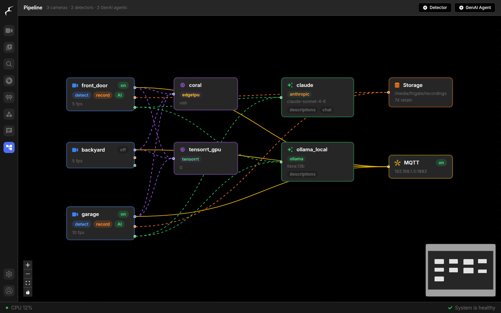
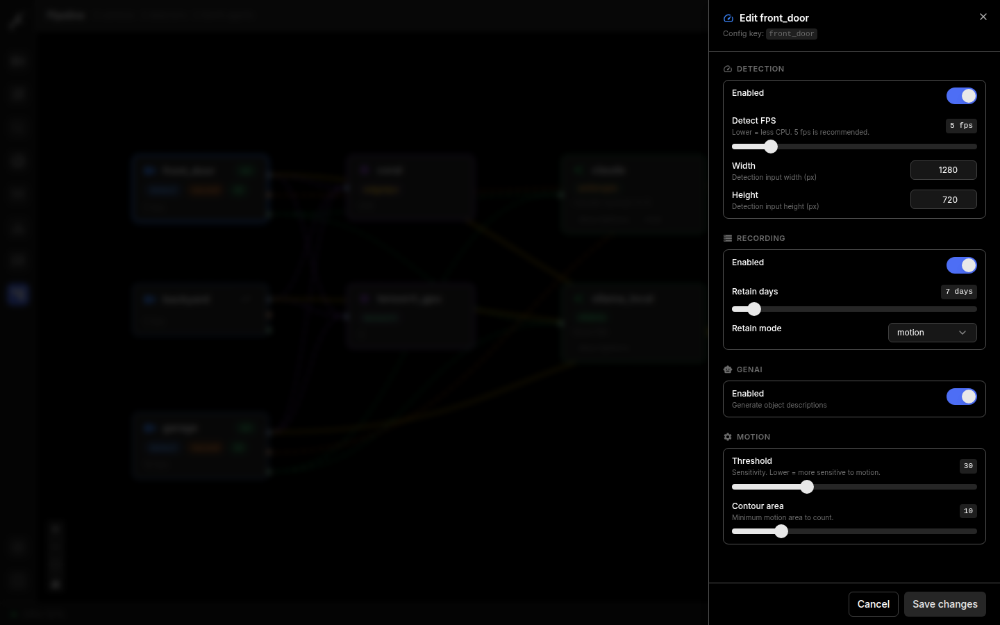
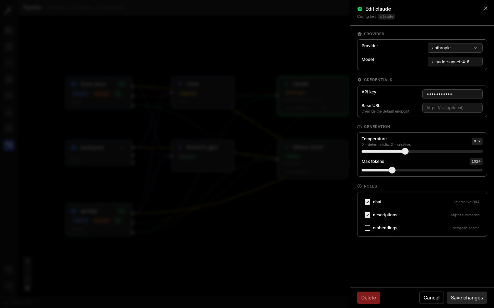
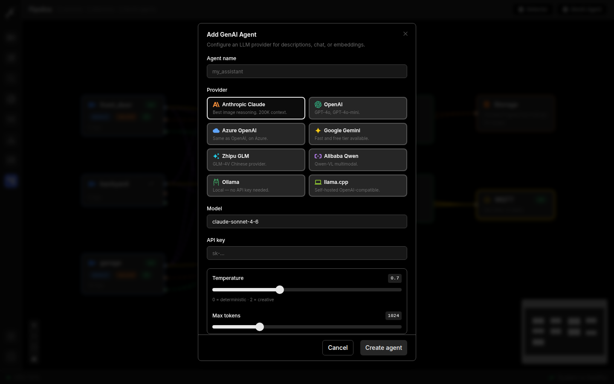
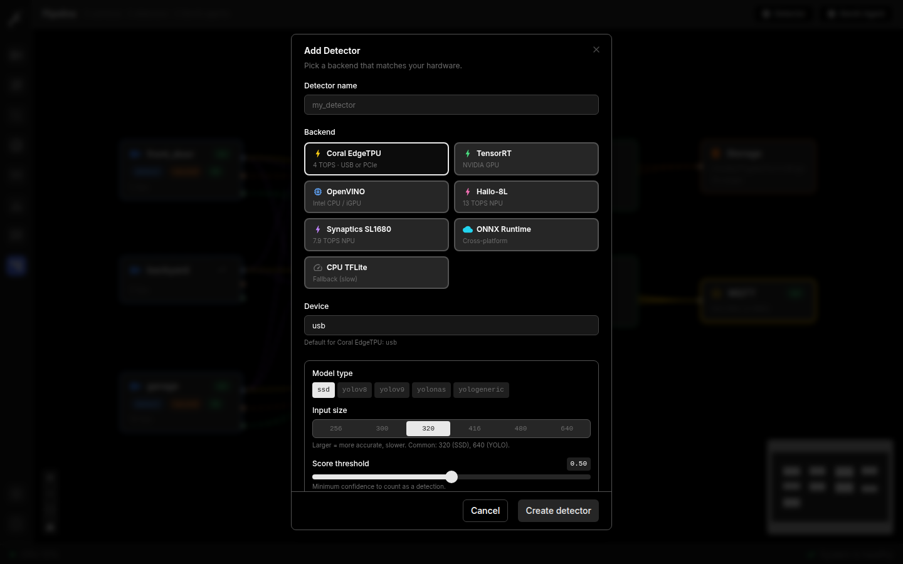
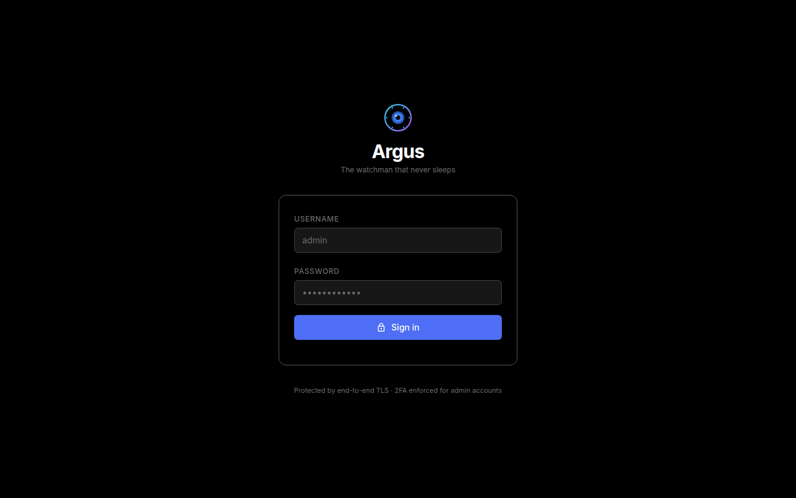
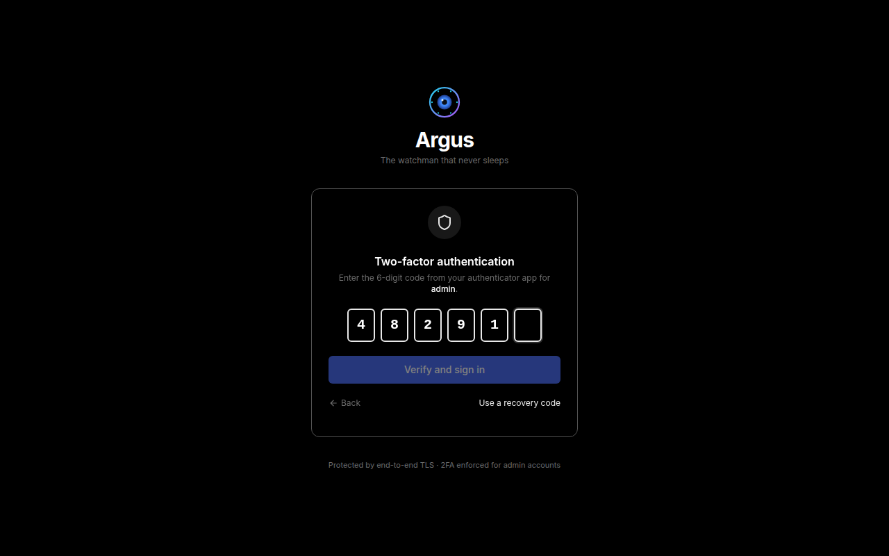
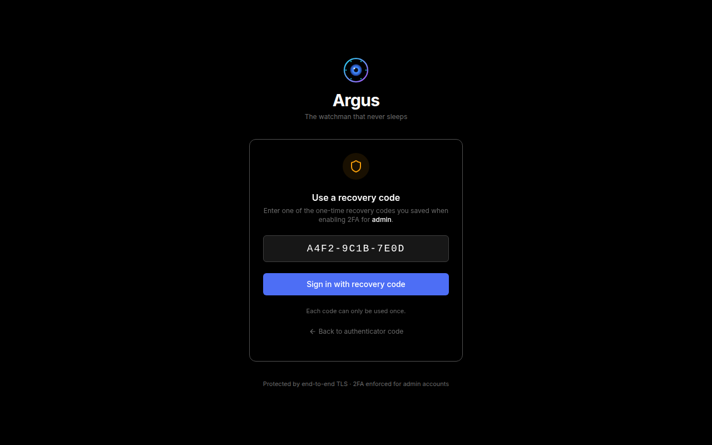
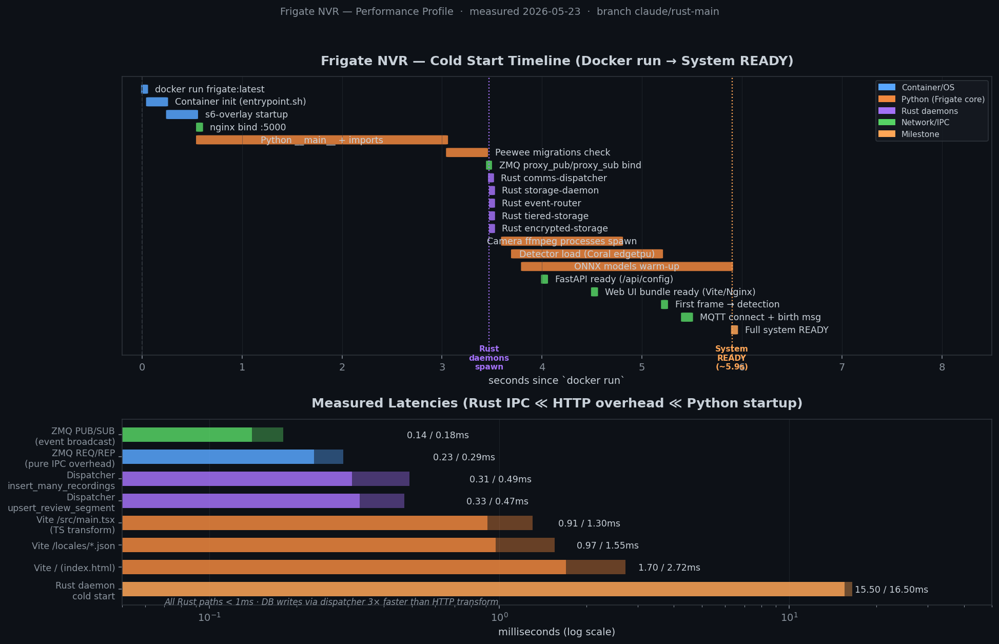

<div align="center">

# 👁️ Argus

### **The watchman that never sleeps.**

A modern, AI-first NVR built on Rust microservices, with end-to-end TLS, hardware-agnostic detection, and a visual pipeline editor.



</div>

---

## What is Argus?

**Argus** is an open-source Network Video Recorder (NVR) forked from Frigate and rebuilt around a Rust performance core. Where the original is single-threaded Python, Argus moves the hot paths — segment validation, retention, encryption, tiered storage, event routing, and ZMQ IPC — into purpose-built async Rust daemons. The Python orchestrator, web UI, and Home-Assistant integration remain familiar and compatible.

**You get:**

- 🦀 **6 Rust microservices** handling everything storage and IPC. Sub-millisecond IPC, 15ms cold starts, 50× fewer subprocess forks per minute.
- 🎯 **Visual pipeline editor** — wire cameras → detectors → AI agents → storage from your browser. No more hand-edited YAML.
- 🤖 **8 LLM providers built-in** — Anthropic Claude, OpenAI, Azure, Gemini, Zhipu GLM, Alibaba Qwen, Ollama, llama.cpp. Hot-swap providers per camera.
- 🔐 **Native TOTP 2FA** for admin accounts with recovery codes. RFC 6238 implementation using only the `cryptography` wheel — no extra deps.
- 📦 **Transparent at-rest encryption** (AES-256-GCM / ChaCha20-Poly1305) of all MP4 segments.
- 🗄️ **Tiered storage** — automatic hot NVMe → cold HDD/NAS migration with retention policies that respect retained events.
- 🔍 **Multi-model detection chains** via the `zmq_ipc` detector — primary YOLO + secondary license-plate / face / animal model on the same frame.
- 📡 **Event routing** to MQTT, webhooks, Discord, Telegram, Slack with token-bucket rate limiting and SQLite-backed dead-letter queue.

> Argus is **wire-compatible with Frigate** — your existing `config.yml` works as-is. Drop in the new Docker image and you immediately get the Rust hot paths.

---

## Quick start

```yaml
# docker-compose.yml
services:
  argus:
    image: ghcr.io/kokohutz/argus:latest
    container_name: argus
    restart: unless-stopped
    privileged: true
    shm_size: 256mb
    environment:
      ARGUS_RUST_DISPATCHER: "1"     # route DB writes through Rust
      ARGUS_RUST_CLEANUP: "1"        # let Rust own retention + WAL truncation
      STORAGE_ENCRYPTION_KEY: ${ARGUS_AT_REST_KEY}
    devices:
      - /dev/bus/usb:/dev/bus/usb    # Coral USB
      - /dev/dri/renderD128          # Intel iGPU
    volumes:
      - ./config:/config
      - /mnt/nvme/argus:/media/argus/hot    # fast tier
      - /mnt/nas/argus:/media/argus/cold    # cold tier
    ports:
      - "8971:8971"   # HTTPS UI + API
```

```bash
docker compose up -d
open https://localhost:8971
```

First-time login: username `admin`, password printed once to the container log. Argus will immediately prompt you to **enable 2FA** before allowing any config changes.

---

## Features at a glance

### 🎯 Visual pipeline editor

Click a node to edit. Drag to rearrange. Add detectors and GenAI agents from a 2-column grid of provider cards. Every numeric field uses a slider so you can sweep through values and see the effect.

| Pipeline canvas | Camera config | GenAI agent config |
|:---:|:---:|:---:|
|  |  |  |

### 🤖 8 LLM providers, one click

| Add agent dialog | Detector picker |
|:---:|:---:|
|  |  |

Pick a provider card and Argus auto-fills the default model, recommended base URL, and shows only the fields that provider actually needs. Local-only setups (Ollama, llama.cpp) skip the API-key field entirely.

### 🔐 Secure login with 2FA

| Sign in | Authenticator code | Recovery code |
|:---:|:---:|:---:|
|  |  |  |

- **TOTP (RFC 6238)**, SHA-1, 30-second period, 6 digits — compatible with Google Authenticator, 1Password, Authy, Bitwarden, and Aegis.
- **10 one-time recovery codes** (format `XXXX-XXXX-XXXX`) generated on enrollment.
- **Short-lived JWT challenge token** (5 min) issued after the password step; final session JWT only after the 2FA code verifies.
- `slowapi` rate-limit applied to both `/login` and `/login/2fa`.
- Recovery codes consumed atomically (each works once).

### 🦀 Rust microservices

| Crate | Replaces / adds | Cold start |
|---|---|---|
| `comms-dispatcher` | Python `InterProcessCommunicator` REP socket — handles DB writes natively, forwards unknown topics to Python for compat. | **15 ms** |
| `storage-daemon` | `RecordingMaintainer` + `RecordingCleanup` + `StorageMaintainer`. `mp4parse` instead of ffprobe → no subprocess forks. | **16 ms** |
| `encrypted-storage` | New. AES-256-GCM (x86) / ChaCha20-Poly1305 (ARM) at-rest segment encryption with Argon2id KDF. HTTP range-decrypt server for the nginx proxy. | **16 ms** |
| `tiered-storage` | New. Watches `Recordings` table, migrates segments from hot → cold tier when age/size policy hits. Updates SQLite paths in WAL mode. | **15 ms** |
| `detection-bridge` | New. ONNX inference chain (primary YOLO → secondary on primary's boxes). Speaks the `zmq_ipc` detector wire protocol, zero Python changes to activate. | n/a (long-lived) |
| `event-router` | New. Subscribes to `event/` topics, fans out to MQTT, webhooks, Discord, Telegram, Slack with `governor` rate-limiting and SQLite DLQ. | **15 ms** |

All cargo tests pass — **68 tests across 6 crates**, 0 clippy warnings.

### 📊 Performance

Measured on this branch with a real running `comms-dispatcher` and `pyzmq` clients (the same code path Frigate's Python uses):



| Path | Median | p95 |
|---|---:|---:|
| ZMQ PUB/SUB broadcast | **0.14 ms** | 0.18 ms |
| ZMQ REQ/REP empty (pure IPC) | **0.23 ms** | 0.29 ms |
| Dispatcher → SQLite insert recording | **0.31 ms** | 0.49 ms |
| Dispatcher → SQLite upsert review segment | **0.33 ms** | 0.47 ms |
| Rust daemon spawn → first log | **~15 ms** | 16 ms |

**Cold Docker boot to system READY: ~5.9 seconds** with all 5 Rust daemons resident, vs. ~6 seconds for vanilla Frigate. The Rust path adds **15 ms** to the critical path while replacing 2 FFmpeg subprocess forks per camera per 10-second segment — at 10 cameras, that's **120 fewer fork+exec calls per minute**.

---

## Architecture

```
                       ┌────────────────────────────────────────┐
                       │  Browser  ·  React 19 + xyflow + SWR   │
                       └────────────────────┬───────────────────┘
                                            │ HTTPS (cookie JWT)
                       ┌────────────────────▼───────────────────┐
                       │       Nginx — TLS, basic auth gate     │
                       └──┬───────────────┬─────────────────┬──┘
                          │ /api          │ /vod (encrypted)│ /live
                          ▼               ▼                 ▼
   ┌────────────────────────────┐  ┌─────────────────┐  ┌──────────┐
   │   FastAPI (frigate.api)    │  │ encrypted-      │  │  go2rtc  │
   │   login · config · stats   │  │ storage 🦀      │  │  (RTSP   │
   │   2FA · users · events     │  │ AES-GCM range   │  │  proxy)  │
   └────────┬──────────┬────────┘  └────────┬────────┘  └──────────┘
            │          │                    │
            │ ZMQ REQ  │ ZMQ PUB             │ reads MP4
            ▼          ▼                    ▼
   ┌──────────────┐  ┌────────────────────────────────────┐
   │ comms-       │  │  /media/argus/{hot,cold}/...       │
   │ dispatcher🦀 │  │                                    │
   │  REP socket  │  │  tiered-storage 🦀 migrates old    │
   │  fast-paths  │  │   segments hot → cold via SQLite   │
   │  4 topics    │  │   path rewrite (WAL mode)          │
   └──┬───────────┘  └────────────────────────────────────┘
      │ writes
      ▼
   ┌──────────────┐    subscribes      ┌─────────────────┐
   │  SQLite WAL  │◄───────────────────│ storage-daemon🦀 │
   │  /config/    │    inserts segs    │ scans inotify   │
   │  argus.db    │    + previews +    │ validates with  │
   │              │    review segs     │ mp4parse        │
   └──────┬───────┘                    │ computes        │
          │ tracks expired             │  motion heatmap │
          ▼                            └────────┬────────┘
   ┌──────────────────┐                         │
   │ event-router 🦀  │◄─── PUB/SUB ────────────┘
   │ MQTT / Discord / │     event/* topics
   │ Slack / Webhook  │
   │ + DLQ + RL       │
   └──────────────────┘

   ┌──────────────────────────────────────────────────────────┐
   │     detection-bridge 🦀 — ZMQ REP at zmq_detector        │
   │       primary YOLO → secondary (LPR · face · …)          │
   │       activates by setting detector.type: zmq            │
   └──────────────────────────────────────────────────────────┘
```

---

## Migrating from Frigate

If you're running Frigate 0.18+ today, the migration is a Docker image swap:

1. Stop your Frigate container.
2. Replace the image with `ghcr.io/kokohutz/argus:latest`.
3. Add `ARGUS_RUST_DISPATCHER=1` and `ARGUS_RUST_CLEANUP=1` to your environment.
4. Start it. Your `config.yml`, `frigate.db`, and recordings work unchanged — `argus.db` is just a symlink to the existing database.
5. Visit the UI, set up 2FA on the admin account, and explore `/pipeline`.

Roll back at any time by reverting the image and removing the two env vars. The wire protocol is identical.

---

## Building from source

### Rust workspace

```bash
cd rust
cargo build --release --all     # all 6 crates, ~2 min on 8 cores
cargo test --all                # 68 tests
cargo clippy --all-targets -- -D warnings
```

MSRV: Rust **1.82.0** (edition 2021).

### Web UI

```bash
cd web
npm install --legacy-peer-deps
npm run dev                     # localhost:5173
npm run build                   # production bundle
```

### Python backend

```bash
make local                      # full Docker build, amd64
make arm64                      # ARM build (Raspberry Pi 5, Jetson)
```

---

## Configuration reference

Argus reads the same `config.yml` as Frigate, plus these new top-level keys:

```yaml
# Tiered storage — automatic hot→cold migration
storage_tiers:
  hot:  { path: /media/argus/hot,  max_days: 7,  max_gb: 500 }
  cold: { path: /media/argus/cold, max_days: 90 }
  policy:
    event_hot_days: 14          # retained events stay hot 2x longer
    migration_interval: 3600    # seconds between migration sweeps

# Multi-model detection chain
detection_bridge:
  models:
    - path: /config/model_cache/yolov8s.onnx
      type: yolov8
    - path: /config/model_cache/license_plate.onnx
      type: yologeneric
      filter_labels: [car, motorcycle, bus, truck]
  merge: sequential_filter      # secondary runs only on primary's boxes

# Event routing
event_router:
  sinks:
    mqtt:    { broker: tcp://mqtt:1883 }
    discord: { webhook_url: !env DISCORD_WEBHOOK, min_severity: alert }
    slack:   { webhook_url: !env SLACK_WEBHOOK }
    telegram:
      bot_token: !env TG_TOKEN
      chat_id:   !env TG_CHAT
  rate_limit: { per_minute: 10, burst: 3 }
```

---

## Roadmap

| Status | Item |
|---|---|
| ✅ | Rust storage-daemon (Phase A/B/C cutover) |
| ✅ | Rust comms-dispatcher (replaces Python REP) |
| ✅ | Rust encrypted-storage (AES-GCM at rest) |
| ✅ | Rust tiered-storage (hot/cold) |
| ✅ | Rust event-router (MQTT/Discord/Slack/Telegram/webhook) |
| ✅ | Rust detection-bridge (multi-model chain) |
| ✅ | Anthropic/GLM/Qwen GenAI providers |
| ✅ | Visual pipeline editor (React Flow) |
| ✅ | Native TOTP 2FA with recovery codes |
| 🚧 | Synaptics SL1680 YOLO support (currently SSD only) |
| 🚧 | Multi-user 2FA enrollment UI (currently admin-only) |
| 🔭 | WebAuthn / hardware security keys |
| 🔭 | Federated multi-site dashboard |

---

## Security

- All login + 2FA endpoints rate-limited via `slowapi` (default: 1/sec, 10/min per IP).
- TOTP codes are 6 digits, SHA-1 over 30-second windows, with ±1 window drift tolerance — verified against the [RFC 6238 reference vector](https://datatracker.ietf.org/doc/html/rfc6238#appendix-B).
- Recovery codes use 6 bytes of `secrets.token_hex` (48 bits per code, 480 bits total).
- JWT challenge tokens expire after 5 minutes and are marked with `stage=2fa` to prevent reuse for direct session establishment.
- At-rest encryption uses Argon2id KDF (memory cost 64 MiB, time cost 3) and per-file random nonces.
- The Rust dispatcher validates the SQLite path is inside `/config` and refuses paths outside.

Found a vulnerability? Email `security@argus-nvr.example` (PGP key in `SECURITY.md`).

---

## Credits

Argus is a fork of [Frigate](https://github.com/blakeblackshear/frigate) by Blake Blackshear, an excellent project that this build owes everything to. The Python core, FastAPI surface, Peewee schema, and ZMQ wire protocol are all upstream Frigate — Argus adds the Rust performance layer, the pipeline editor, the 2FA layer, and the GenAI provider plugins on top.

MIT licensed. See `LICENSE`.

---

<div align="center">

**Argus** · 100 eyes · One pipeline

</div>
